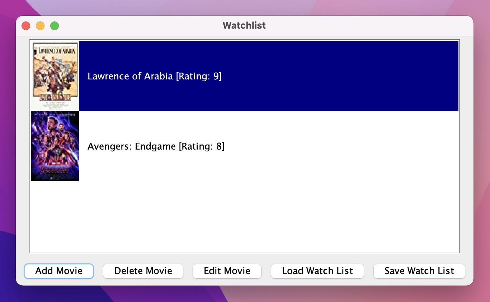
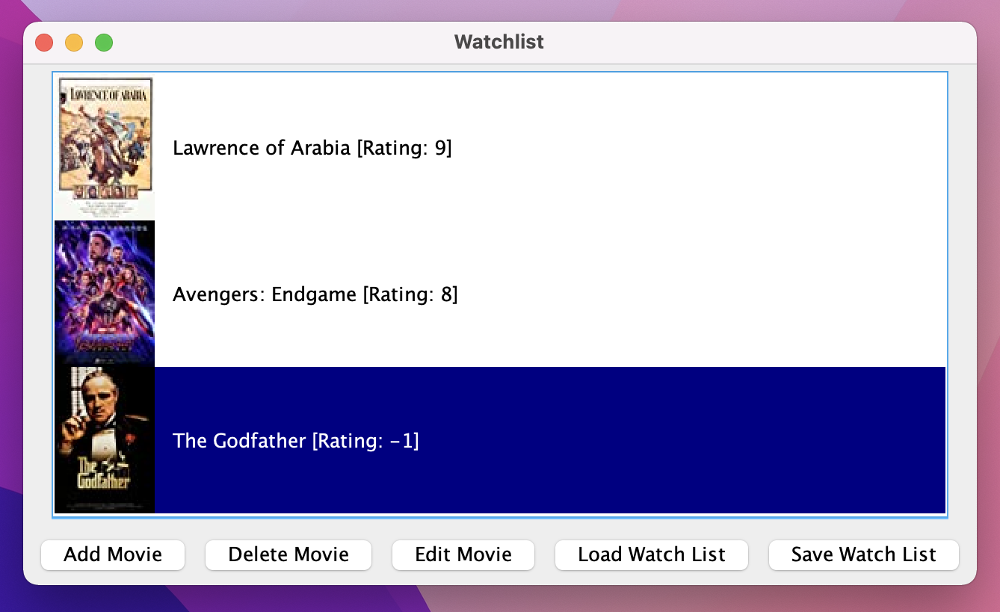

# Movie Watch List
A simple Java Swing desktop app that tracks and rates movies a user has watched that I built for CPSC 210 at the 
University of British Columbia.

## Table of Contents
- [Demo](#demo)
- [Project Structure](#project-structure)
- [Logs](#logs)
- [Data](#data)
- [Future Plans](#future-plans)

<a name="demo"/>

## Demo
To add a movie click the add movie button at the bottom of the frame.

A new window will pop up. Search for a movie using the search bar and Search Movie button. Select the movie and click the Add Selected button to add it to the watch list.

The movie is now on the watch list. To rate it, select the movie and click the Edit Movie button.

A new window containing movie details will pop up. Select a rating from the dropdown menu and click the Change Rating
button.

The movie will now display the chosen rating on the watch list.

Use the Load Watch List and Save Watch List buttons to save and load the watch list to/from a JSON file.

<a name="project-structure"/>

## Project Structure
The application is structured to have three frames: MainFrame, EditFrame, SearchFrame.
Each frame consists of a few panels, which each have their own separate purposes.
The application is based around finding movies, adding and removing them from lists, and making changes to them.
All of this is done within the WatchList, MovieSearchList, MovieList, and Movie classes.

<a name="logs"/>

## Logs
The application prints out all changes made to the watch list to the console when it exits.

<a name="data"/>

## Data
All movie data and icons are from
[this](https://www.kaggle.com/harshitshankhdhar/imdb-dataset-of-top-1000-movies-and-tv-shows?select=imdb_top_1000.csv)
Kaggle dataset.

<a name="future-plans"/>

## Future Plans
- Expand number of available movies (currently 1000)
  - Create database
  - Write python script fetch IMDb movies/shows and update database
- Recommendation system

